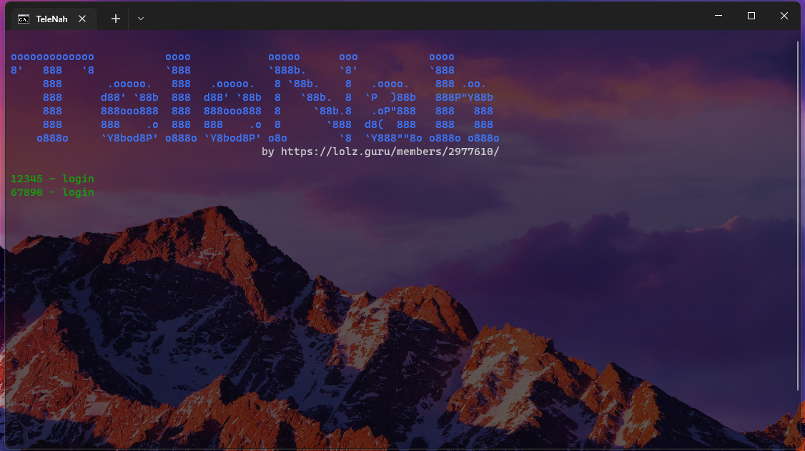

# TeleNah
:heart_eyes: by https://lolz.guru/members/2977610/     
----  
    Информация
После успешного запуска ждёт пока будет любой пост в каналах (которых аккаунт есть) и если у него открыты комментарии, то отправляет сообщение под этим постом.
Автовступление в каналы ("join_channels")

    Настройка
> config.json
> - "text": "https://pastebin.com/raw/z0YSrLf"  - ссылка на pastebin.com в raw виде (ex: https://pastebin.com/raw/z0YSrLfn)
> - "report": "Токен бота|ваш ID (куда отправлять отчёт)" - для отключения отчёта, просто: false
> - "PatchFileAccounts": "accounts.txt" - имя файла с аккаунтами (поместить в папку с прогой) в виде: api_id:api_hash как получить: https://core.telegram.org/api/obtaining_api_id
> - "edit_data": true - менять имя, фамилию и никнейм после отправки сообщения (true/false)               
> - "join_channels": "channels.txt" - путь до файла с каналами в виде: @channel - для паблика и https://t.me/+ReZyzztEZGc1NDVi, либо ReZyzztEZGc1NDVi (ну всё после https://t.me/+) - если будет неверно ошибку выдаст  - для отключения, просто: false.
-----
    Инструкция по запуску

> Windows:
> - Установить Python 3.9
> - Запустить файл install_libs.cmd
> - Заполнить файл config.json
> - Запустить start.cmd
-----
>Linux (ubuntu и другие на этой платформе)
> - Установить Python 3.9 
>> - Запустить install_pyenv.sh
>> - Запустить set_pyenv.sh
> - Запустить install_libs.sh
> - Заполнить файл config.json
> - Запустить start.sh

    Скриншот

